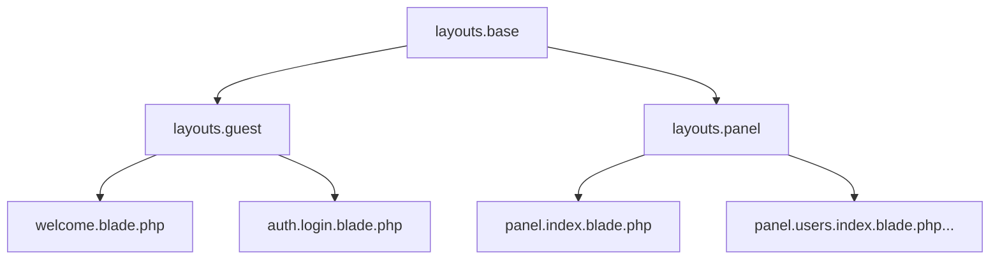

# Unified Design System

This document outlines the strategic structure for the application's visual identity, bridging the gap between the Front Office (Guest/Landing) and the Back Office (Panel).

## 1. Design Tokens (CSS Variables)

All styles MUST use these variables to ensure theme consistency. Hardcoded hex values are forbidden outside of the `:root` definitions.

| Category | Token | Description |
| :--- | :--- | :--- |
| **Surfaces** | `--bg-body` | Main background of the application. |
| | `--bg-card` | Background for cards and elevated panels. |
| | `--bg-input` | Background for form inputs. |
| | `--bg-table-header` | Background for table headers. |
| **Text** | `--text-main` | Primary text color. |
| | `--text-muted` | Secondary/de-emphasized text color. |
| | `--text-brand` | Color used for logos and branding. |
| **Brand** | `--primary` | Main accent color (e.g., Purple). |
| | `--primary-hover` | Darker/Brighter variant for hover states. |
| | `--primary-glow` | Subtle shadow/glow color for buttons. |
| **Feedback** | `--success`, `--danger`, `--warning` | Standard status colors. |
| **Borders** | `--border` | Default border color. |
| | `--border-focus` | Border color when an element is focused. |
| **Effects** | `--glass-blur` | Blur amount for glassmorphic elements (0 for Non-Glass). |
| | `--shadow-lg` | Standard elevation shadow. |

## 2. Shared Components

### Surfaces
- **`.card`**: The base container for content. Supports `.glass-card` variant.
- **`.stat-card`**: Optimized for dashboard metrics.

### Actions
- **`.btn`**: Base button reset.
- **`.btn-primary`**: Solid brand color.
- **`.btn-block`**: Full-width button.
- **`.btn-link`**: Text only, button behavior.

### Forms
- **`.form-control`**: Standard styling for `input`, `select`, and `textarea`.
- **`.form-label`**: Clean, muted labels.

## 3. Layout Architecture

We will use a tiered layout system to maximize code reuse:

### `layouts.base`
- Master HTML structure.
- Injects dynamic CSS links based on `AssetController`.
- Handles `<meta>` tags and CSRF.
- Includes common scripts (e.g., Tom Select).

### `layouts.guest` (Front Office)
- Extends `base`.
- Sets `theme-dark` by default (unless user is logged in).
- Horizontal navigation or minimal header.

### `layouts.panel` (Back Office)
- Extends `base`.
- Sidebar + Header + Main content structure.
- User-specific theme from DB.
