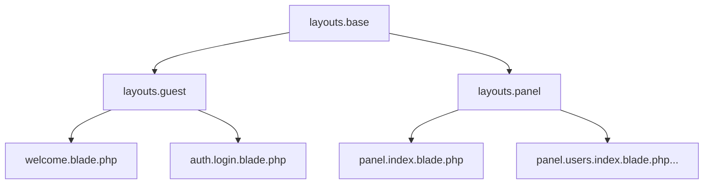

# Sistema de Diseño Unificado

Este documento describe la estructura estratégica para la identidad visual de la aplicación, cerrando la brecha entre el Front Office (Invitado/Landing) y el Back Office (Panel).

## 1. Tokens de Diseño (Variables CSS)

Todos los estilos DEBEN usar estas variables para asegurar la consistencia del tema. Los valores hexadecimales fijos están prohibidos fuera de las definiciones `:root`.

| Categoría | Token | Descripción |
| :--- | :--- | :--- |
| **Superficies** | `--bg-body` | Fondo principal de la aplicación. |
| | `--bg-card` | Fondo para tarjetas y paneles elevados. |
| | `--bg-input` | Fondo para entradas de formulario. |
| | `--bg-table-header` | Fondo para encabezados de tabla. |
| **Texto** | `--text-main` | Color de texto primario. |
| | `--text-muted` | Color de texto secundario/atenuado. |
| | `--text-brand` | Color usado para logos y branding. |
| **Marca** | `--primary` | Color de acento principal (ej: Púrpura). |
| | `--primary-hover` | Variante más oscura/brillante para estados hover. |
| | `--primary-glow` | Color de sombra/resplandor sutil para botones. |
| **Feedback** | `--success`, `--danger`, `--warning` | Colores de estado estándar. |
| **Bordes** | `--border` | Color de borde por defecto. |
| | `--border-focus` | Color de borde cuando un elemento tiene foco. |
| **Efectos** | `--glass-blur` | Cantidad de desenfoque para elementos glassmórficos. |
| | `--shadow-lg` | Sombra de elevación estándar. |

## 2. Componentes Compartidos

### Superficies
- **`.card`**: El contenedor base para contenido. Soporta la variante `.glass-card`.
- **`.stat-card`**: Optimizado para métricas de dashboard.

### Acciones
- **`.btn`**: Reset de botón base.
- **`.btn-primary`**: Color sólido de marca.
- **`.btn-block`**: Botón de ancho completo.
- **`.btn-link`**: Solo texto, comportamiento de botón.

### Formularios
- **`.form-control`**: Estilo estándar para `input`, `select` y `textarea`.
- **`.form-label`**: Etiquetas limpias y atenuadas.

## 3. Arquitectura de Layout

Utilizaremos un sistema de layouts escalonado para maximizar la reutilización de código:

### `layouts.base`
- Estructura HTML maestra.
- Inyecta enlaces CSS dinámicos basados en `AssetController`.
- Maneja etiquetas `<meta>` y CSRF.
- Incluye scripts comunes (ej: Tom Select).

### `layouts.guest` (Front Office)
- Extiende `base`.
- Establece `theme-dark` por defecto (a menos que el usuario esté logueado).
- Navegación horizontal o encabezado mínimo.

### `layouts.panel` (Back Office)
- Extiende `base`.
- Estructura de Sidebar + Header + Contenido principal.
- Tema específico del usuario desde la DB.
