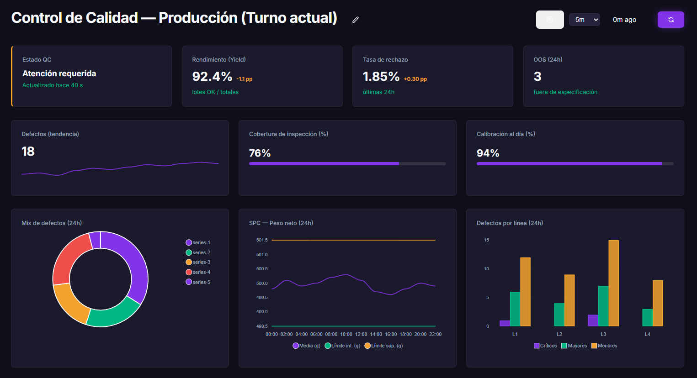

## Echa un vistazo al interior

### 📊 Dashboards en Tiempo Real
Visualiza datos desde tus servicios upstream (n8n, Make) con tasas de refresco automáticas y sin almacenamiento en base de datos.

### 📝 Formularios Interactivos
Crea formularios de entrada seguros que sanean y reenvían datos a tus webhooks de automatización.

---

## 📚 Secciones de la Documentación

- **[Guía de Inicio Rápido](getting_started.md)**: Instalación, requisitos previos y acceso inicial.
- **[Configuración](configuration.md)**: Variables de entorno, base de datos y configuración de temas.
- **[Roles y Permisos](user_roles.md)**: Comprendiendo el modelo "Default Deny" y la gestión de grupos.
- **[Upstream Proxy](upstream_proxy.md)**: Cómo funciona la seguridad, credenciales y sanitización.
- **[Guía General de Páginas](creating_pages.md)**: El modelo de páginas en Laracloak.
- **[Formularios (Forms)](forms.md)**: Guía detallada y ejemplos de configuración para formularios de salida.
- **[Dashboards (Paneles)](dashboards.md)**: Guía detallada y ejemplos para visualización de datos de entrada.
- **[Sistema de Diseño](design_system.md)**: Identidad visual y tokens CSS.
- **[🔐 Autenticación JWT](jwt_usage.md)**: Configuración de Upstreams con generación de JWT.

---

## ⚡ Enlaces Útiles
- [Repositorio en GitHub](https://github.com/fuseprods/laracloak)
- [Licencia MIT](https://github.com/fuseprods/laracloak/blob/main/LICENSE)
